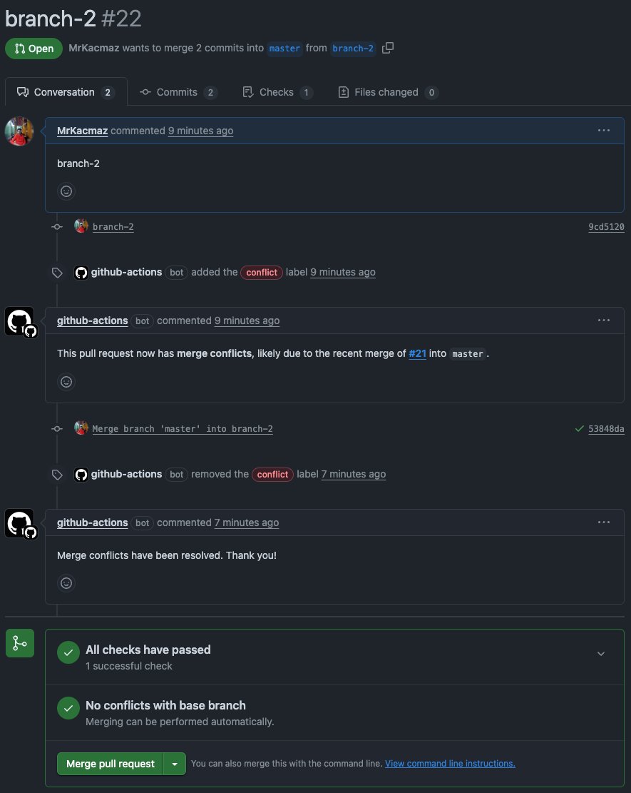

# 🔀 GitHub Pull Request Conflict Manager

This repository provides two GitHub Actions workflows to automatically manage the `conflict` label on pull requests
(PRs) based on their mergeable status.
These workflows help your team identify and resolve merge conflicts more efficiently.

## 📦 Included Workflows

### 1. `conflict-adder.yml`
Automatically adds a `conflict` label and a comment to any open PRs
that become conflicted after another PR is merged into the base branch
(typically `master` or `develop`).

#### 🔧 Triggered When:
- A pull request is **closed and merged** into the target branch.

#### 🧠 What It Does:
- Iterates through all open PRs targeting the same base branch.
- Checks if any of them now have merge conflicts.
- If so, adds a `conflict` label and posts a comment like:
  > _"This pull request now has **merge conflicts**, likely due to the recent merge of **#123** into `master`."_

---

### 2. `conflict-remover.yml`
Automatically removes the `conflict` label and posts a follow-up comment when the conflict is resolved
(typically after new commits are pushed to the PR branch).

#### 🔧 Triggered When:
- A pull request is **edited** or **synchronized** (i.e., new commits are pushed).

#### 🧠 What It Does:
- Checks if the PR is now mergeable (i.e., no longer has conflicts).
- If so:
    - Removes the `conflict` label.
    - Posts a comment like:
      > _"Merge conflicts have been resolved. Thank you!"_

#### 🖼️ Visual Example

Here’s how a PR looks when a conflict is detected and labeled automatically:

---

## 🏷️ Requirements

- These workflows expect a label named `conflict` to exist in your repository. Create it manually via the GitHub UI if it doesn't exist.
- Make sure your base branch (e.g., `master`, `develop`) is correctly set in each workflow file under the `branches` key.

---

## ✅ Benefits

- Saves time by automatically tracking PRs that require attention due to merge conflicts.
- Keeps your PR list clean and well-labeled.
- Improves collaboration by notifying authors directly with friendly comments.

---

## 📜 License

This project is released under the [MIT License](LICENSE).

--- 

## 🙌 Contributing

Feel free to open an issue or PR if you'd like to improve or extend these workflows!